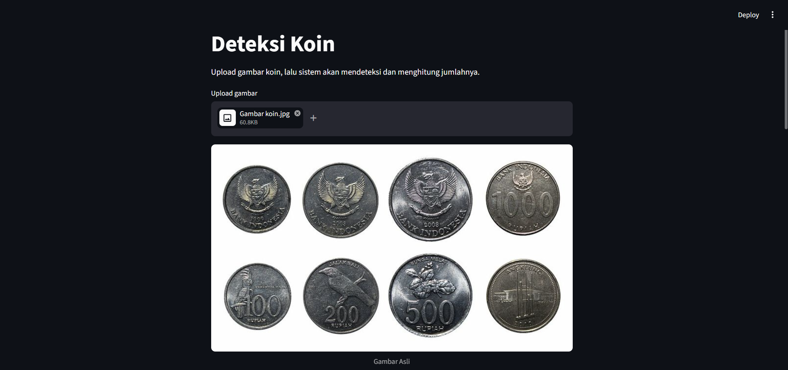
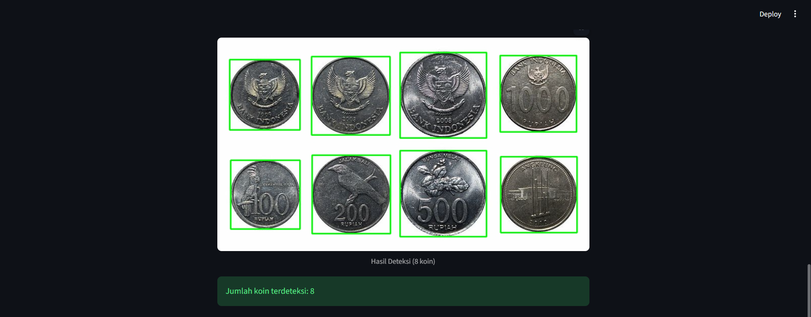

# Deteksi-Koin-Menggunakan-OpenCV-dan-Streamlit
Aplikasi berbasis web untuk mendeteksi dan menghitung jumlah koin pada gambar menggunakan metode pengolahan citra digital dengan OpenCV dan Streamlit.
Mengapa memilih gambar koin?
Disini saya ingin menerapkan berbagai metode yang telah dijelaskan.

## Link Streamlit
https://deteksi-koin-menggunakan-opencv-dan-app-gwww3wdepvsqofga7oc4pn.streamlit.app/

## Fitur
- Upload gambar koin
- Segmentasi menggunakan Otsu Threshold
- Pembersihan noise (Morphology + Median Blur)
- Deteksi objek menggunakan Contour Detection
- Menghitung jumlah koin secara otomatis
- Menampilkan hasil dalam bentuk visual

## Teknologi
- Python
- OpenCV untuk pengolahan citra
- Streamlit untuk tampilan web
- NumPy untuk manipulasi array
- Pillow untuk membaca gambar

## Preview
Screenshot hasil aplikasi:
### Gambar Asli

### Threshold

### Threshold Bersih

### Hasil Deteksi

## Cara Menjalankan
### 1. Clone repository
https://github.com/alnonym/Deteksi-Koin-Menggunakan-OpenCV-dan-Streamlit
### 2. Install dependencies
pip install -r requirements.txt
### 3. Jalankan aplikasi
streamlit run app.py
### 4. Buka di browser
http://localhost:8501

## Author
Alif Wahyudi
